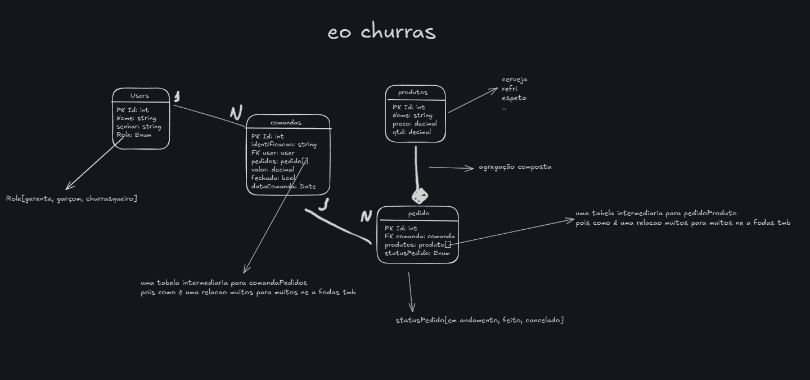

# E o Churras

## Problema
Durante o atendimento é necessário que o cliente abra uma comanda com o garçom/caixa, realize o seu pedido, então é repassado para o churrasqueiro e quando o pedido fica pronto o churrasqueio avisa ao garçom que então leva para o cliente tudo isso é feito com papel e caneta, ao final a moça do caixa soma manualmente os itens. 

<b>Esse processo propenso a erros e pouco eficiente.</b>

## Solução:
Uma aplicação que cria uma linha de comunicação entre o churrasqueiro e o garçom, assim o garçom abre as comandas e realiza os pedidos. O churrasqueiro consegue ver os pedido pendes, quando prontos o garçom recebe uma notificação, ao final o valor da comanda e somado automaticamente, facilitando o atendimento  e diminuindo os erros.

## Features
- [ ] Cadastrar e gerenciar produtos
	- [x] Create produtos
	- [x] Read protudos
	- [ ] Update protudos
	- [ ] Delete protudos
	- [x] Add produto na lista de pedidos
 - [x] Criar diferentes perfil(caixa/garçom, churrasqueiro, gerente)
 - [x] Abrir comanda
 - [x] Add pedidos a comanda
 - [ ] Fechar comanda
 - [ ] Relatórios diários, semanais e mensais
 - [x] Churrasqueiro deve ver em tempo real os pedidos realizados
- [x] Garçom recebem em tempo real uma notificação quando o pedido estiver pronto
 - [x] Pedidos devem ter status(em andamento, feito, cancelado)
 - [ ] Caixa/garçom deve ser capaz de acompanhar o status do pedido
 - [x] churrasqueiro deve ser capaz de alterar o status do pedido
 - [ ] Add JWT nas requisições
 - [ ] Somente o gerente pode criar, editar e deletar usuarios
- [ ] Somente o gerente pode criar, editar e deletar produtos

Ia escrever isso no formado requisitos funcionais e não funcionais, porem não queria perder tempo com documentação, quero sair logo com o MVP e testar se o mercado aceita.

### Modelagem do banco

Sim eu fiz a modelagem pensando no banco noSql e implemente um SQL.

##  Stack utilizada

-   **Backend**: Go (com GORM, Gorilla Mux, Gorilla WebSocket)
-   **Banco de dados**: MariaDB(pq sim)
-   **Frontend**: HTML, CSS, JavaScript (puro msm já qu eu so fiz um MVP)
-   **Servidor**: Nginx
-   **Deploy**: Docker + Docker Compose

## Se quiser rodar essa bomba

`docker-compose up --build`  

Vai rodar no localhost msm `http://localhost` sem vps pra mim );
